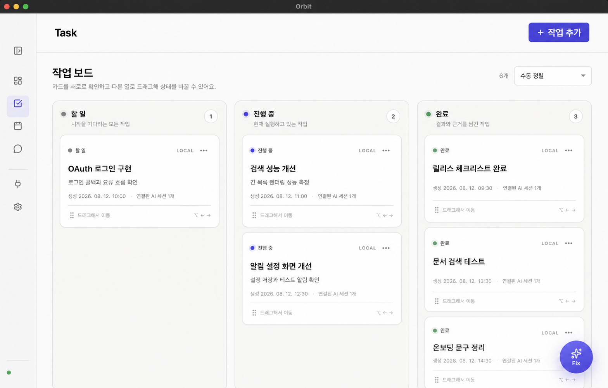
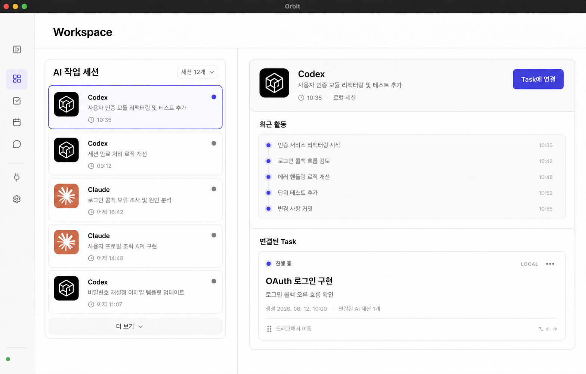
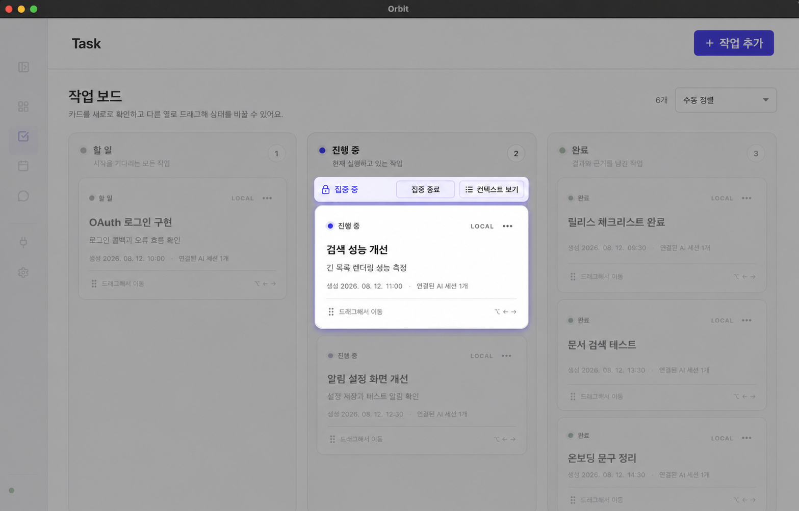
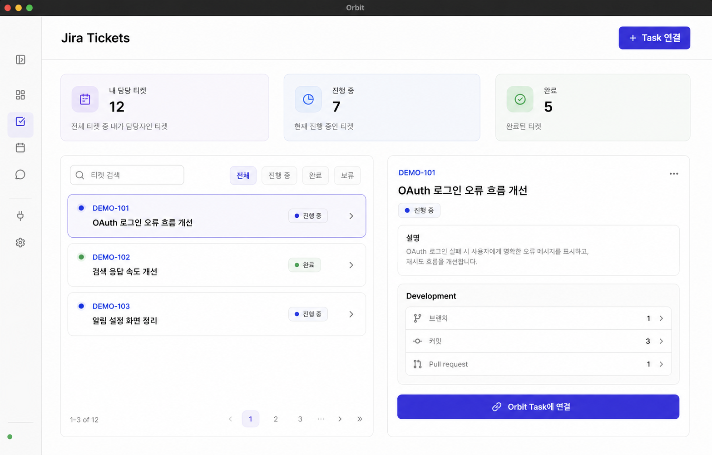
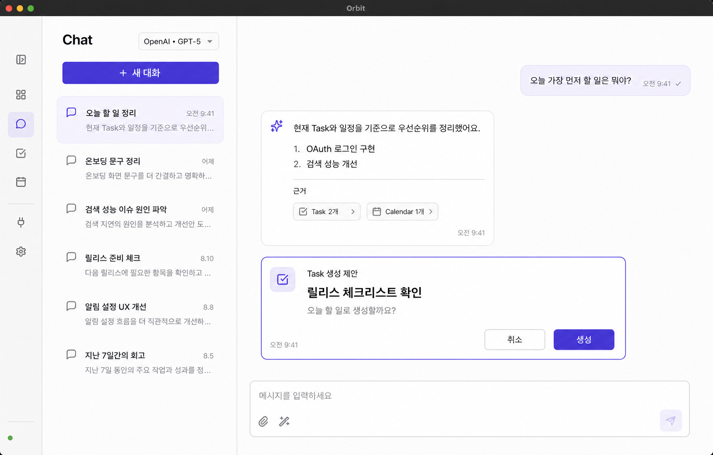
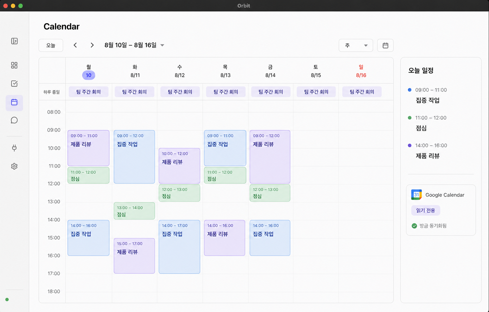
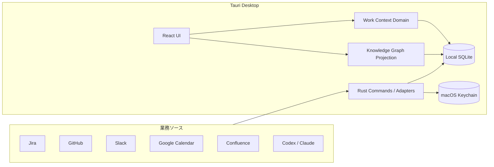

# Orbit

<p align="center">
  <a href="README.md">English</a> ·
  <a href="README.ko.md">한국어</a> ·
  <strong>日本語</strong>
</p>

> 分散した業務コンテキストをつなぎ、仕事を忘れず、すぐに再開できるようにする macOS 向けパーソナル・ワークインテリジェンス基盤。

[](https://github.com/ckdwns9121/orbit/actions/workflows/ci.yml)
[](https://github.com/ckdwns9121/orbit/actions/workflows/release.yml)




Orbit は単なる Todo リストではありません。Jira、GitHub、Slack、Calendar、Confluence、AI 作業セッションに分散した **進捗地点、次のアクション、関連する会話、開発上の根拠** を一つの Task を中心につなぎます。緊急作業に割り込まれても以前の文脈を素早く復元し、完了した仕事を振り返りや実績として残せます。

Orbit が減らしたいのは Todo の不足ではなく、**自分の業務状態を毎回記憶し、復元しなければならないコスト**です。

> [!IMPORTANT]
> Orbit は個人利用を中心に高速で開発している初期段階のプロジェクトです。現在は macOS のみをサポートし、外部連携 API や画面は変更される可能性があります。

## 目次

- [なぜ Orbit なのか](#なぜ-orbit-なのか)
- [Orbit が解決する問題](#orbit-が解決する問題)
- [基本ワークフロー](#基本ワークフロー)
- [主な機能](#主な機能)
- [画面紹介](#画面紹介)
- [連携サービス](#連携サービス)
- [インストールと実行](#インストールと実行)
- [技術スタック](#技術スタック)
- [アーキテクチャ](#アーキテクチャ)
- [開発](#開発)
- [データとセキュリティ](#データとセキュリティ)
- [ドキュメント](#ドキュメント)
- [コントリビューションとライセンス](#コントリビューションとライセンス)

## なぜ Orbit なのか

AI と複数のコラボレーションツールを併用すると、実際の仕事の流れは簡単に分断されます。タスクと状態は Jira、議論と依頼は Slack、実装結果は GitHub、予定は Calendar、文書は Confluence、作業過程は Codex や Claude に残ります。それらを最終的につなぐ責任はユーザーの記憶に委ねられています。

- Jira チケットから Slack の会話を確認し、GitHub の PR に移動します。
- Codex や Claude に仕事を任せて別の作業を始めると、以前の進捗地点を忘れます。
- 本当の優先順位より、新しい通知や依頼への反応が中心になります。
- 実際の進捗と Jira の状態がずれ、オンコール依頼を探すために Slack を再検索します。
- 完了した仕事が分散し、振り返りや実績資料を作りにくくなります。

Orbit は **Task を業務の SSOT（Single Source of Truth）** として扱います。Jira、PR、commit、Slack メッセージ、AI セッションは Task を説明する根拠であり、Task 自体を置き換えるものではありません。一日の仕事を決め、一つの作業に集中し、中断時にチェックポイントを残し、完了時に成果と根拠を保存します。

## Orbit が解決する問題

Orbit の目的は記録量を増やすことではなく、ユーザーが覚えていなくてもシステムが業務コンテキストを維持することです。

| 問題 | Orbit の解決方法 |
| --- | --- |
| 複数タスクを行き来すると進捗地点を失う | 最新の進捗、次のアクション、関連根拠を Task のチェックポイントとして保存 |
| 緊急作業に割り込まれると以前の仕事を忘れる | 進行中の仕事と優先順位を維持し、再開用コンテキストを提供 |
| Jira の状態と実際の進捗がずれる | AI セッション、commit、PR、チケット状態をまとめて表示し、不一致を検出 |
| 完了した仕事が振り返りや実績として残らない | 結果、判断、リスク、開発根拠を完了履歴として蓄積 |
| Slack の依頼や過去の会話を毎回検索する | 日付・テーマ検索、原文リンク保存、Task への接続 |

Orbit は次の四つの役割を担います。

1. **コンテキスト復元** — Task を開くと Jira、Slack、GitHub、文書、AI セッション、最後の進捗地点を表示します。
2. **業務同期** — 外部活動を根拠として Task とチケットの状態不一致を見つけます。
3. **優先順位判断** — 締切、予定、レビュー依頼、進行中の仕事をまとめて判断します。
4. **業務記憶と実績蓄積** — 完了した作業を再利用できる振り返り・実績記録として保存します。

## 基本ワークフロー

```text
Planner で今日の仕事を選択
        ↓
Task に Jira · GitHub · Slack · AI セッションを接続
        ↓
一つの Task に集中
        ↓
中断前に現在までの進捗と次のアクションを記録
        ↓
完了時に結果 · 判断 · リスク · 根拠を保存
```

Planner で作成した Todo は別のコピーではなく、Task ボードに表示される同一の Task です。

## 主な機能

### Planner と Task

- 月間 Planner と日付別 Todo
- 仕事・学習・個人作業を分けるカテゴリ
- 曜日ベースの繰り返しルーティンとリマインダー
- 今日必ず終える重要 Task を最大三件固定
- Todo・進行中・完了 Kanban とドラッグ＆ドロップ
- 優先順位、目標時刻、作成日時による並び替え

### 集中と業務継続性

- 同時に一件だけ許可する集中モード
- 集中中は他の作業とアプリ領域を一時的に無効化
- 作業切り替え前にチェックポイントと次のアクションを記録
- 関連根拠を含む完了振り返り、または明示的なスキップ
- 目標時刻を過ぎた未完了 Task の macOS 通知
- 設定した周期で送るストレッチ通知

### 接続された業務コンテキスト

- 担当 Jira チケットと Task の接続
- 自分が作成した PR と自分のレビュー待ち PR の確認
- PR、commit、branch、Jira development 情報の追跡
- Slack メッセージ検索と原文 permalink の保存
- Codex・Claude のローカルセッション探索と Task 接続
- Google Calendar の読み取り専用同期
- Task と外部根拠を探索する Knowledge Graph

### AI と自動化

- 業務データに基づく Chat のストリーミング応答
- 会話から提案された Task をユーザー承認後に作成
- Task の説明をもとに関連セッション・チケット・メッセージを探索
- 全 Task の優先順位と目標時刻を提案
- 外部変更は preview とユーザー承認後にのみ実行

### macOS 体験

- メニューバー Quick View で集中作業と次の作業を確認
- グローバルショートカットで Task パネルと Chat を開く
- 目標時刻・ストレッチ通知
- システム、ライト、ダークテーマ
- macOS Keychain に認証情報を保存

## 画面紹介

以下の画像は公開ドキュメント用の架空データです。実際のユーザー、企業、リポジトリ、業務情報は含まれていません。

### AI 作業セッションの接続

Codex と Claude のローカル作業セッションを探索し、一つの Orbit Task に接続します。最近の活動と接続された作業を同時に確認できます。



### 単一 Task 集中モード

一つの Task に集中すると、他の作業とナビゲーションを一時的に無効化します。コンテキスト確認、完了、終了に必要な操作だけを残します。



### Jira チケットと開発根拠

担当 Jira チケットを状態別に検索し、branch、commit、pull request を確認して Orbit Task に接続できます。



### 根拠に基づく AI Chat

現在の Task、Calendar、接続済み業務データを根拠に回答します。AI が Task を提案しても、ユーザー承認なしに作成されることはありません。



### Google Calendar 読み取り専用連携

Google Calendar の予定を週表示で確認し、会議と集中時間を一緒に計画します。Orbit は元の予定を編集・削除しません。



## 連携サービス

| サービス | 提供機能 | 認証方式 |
| --- | --- | --- |
| Jira Cloud | 担当チケット、状態、Task 接続、development 情報 | サイト URL + Atlassian API token |
| Confluence | 閲覧権限のある文書検索と業務根拠接続 | Jira と同じ Atlassian アカウント |
| GitHub | 作成した PR、レビュー依頼 PR、commit・branch 追跡 | ローカル `gh` と Git repository |
| Slack | メッセージ検索、permalink 保存、Task 変換 | Slack OAuth token |
| Google Calendar | 予定のタイトル・時刻・場所の読み取り専用同期 | システムブラウザ OAuth + PKCE |
| Codex / Claude | ローカルセッション探索、別名、Task 接続 | ローカルセッションファイル |
| OpenAI / Claude / GLM | Chat、Task 分析、自動化提案 | OAuth または provider API key |

すべての連携は任意です。外部サービスを接続しなくても Planner と Task はローカルアプリとして利用できます。

## インストールと実行

### ダウンロード

配布ビルドは [GitHub Releases](https://github.com/ckdwns9121/orbit/releases) で提供する予定です。公開 Release がない場合はソースから実行してください。

### 必要環境

- macOS 13 以降
- [Bun](https://bun.sh/) 1.3.6
- Rust stable
- Xcode Command Line Tools

```bash
xcode-select --install
```

### ソースから実行

```bash
git clone https://github.com/ckdwns9121/orbit.git
cd orbit
bun install --frozen-lockfile
bun run tauri dev
```

通知機能を初めて使うとき、macOS が Notification 権限を要求します。外部サービスは `Settings` から必要なものだけ接続できます。

### macOS アプリのビルド

現在の Mac アーキテクチャ向け App と DMG を生成します。

```bash
bun run bundle:mac
```

Apple Silicon と Intel を含む Universal ビルド：

```bash
rustup target add aarch64-apple-darwin x86_64-apple-darwin
bun run bundle:mac:universal
```

成果物は `src-tauri/target/release/bundle/` に生成されます。

## 技術スタック

| 領域 | 技術 |
| --- | --- |
| Desktop shell | Tauri 2 |
| Native backend | Rust 2021, reqwest, rustls |
| Frontend | React 19, TypeScript 5.8 |
| Build | Vite 7, Bun 1.3.6 |
| Styling | Sass/SCSS, Lucide React |
| Local database | SQLite, Tauri SQL plugin |
| Secret storage | macOS Keychain, Rust `keyring` |
| Native features | Tray, global shortcut, notification, opener plugins |
| Testing | Bun Test, Cargo Test |
| Delivery | GitHub Actions, Tauri Action |

## アーキテクチャ



フロントエンドは Feature-Sliced Design の一方向依存ルールに従います。

```text
app → pages → widgets → features → entities → shared
```

```text
src/
├── app/         # 初期化、シェル、ナビゲーション
├── pages/       # Planner、Calendar、Chat、Graph、Settings
├── widgets/     # メニューバー Quick View などの複合 UI
├── features/    # 集中、同期、Task 接続、通知
├── entities/    # WorkItem と外部コンテキストのモデル・repository
├── shared/      # 共通 UI、theme、SCSS token
└── tests/       # 機能境界と統合テスト

src-tauri/
├── migrations/  # 順次適用される SQLite schema migration
└── src/         # Tauri command、OAuth、外部 API adapter
```

### 設計原則

1. **Task が SSOT。** 外部チケットや会話は Task に接続された根拠です。
2. **ローカルファースト。** 業務データはユーザーの SQLite に保存します。
3. **集中は一件だけ。** 切り替えにはチェックポイントが必要です。
4. **外部書き込みには承認が必要。** preview、revision 検証、復旧境界を通します。
5. **Graph は projection。** 原本を変更せず、いつでも再構築できます。
6. **秘密情報を DB に保存しない。** token と API key は Keychain に保存します。

## 開発

| コマンド | 説明 |
| --- | --- |
| `bun run tauri dev` | Vite と Tauri 開発アプリを実行 |
| `bun run build` | TypeScript 検査と production frontend build |
| `bun test` | frontend unit・integration test を実行 |
| `bun run verify:fsd` | FSD 構造と依存方向を検証 |
| `cargo test --manifest-path src-tauri/Cargo.toml` | Rust test を実行 |
| `bun run release:check` | package、Tauri、Cargo のバージョンを検証 |
| `bun run bundle:mac` | macOS App と DMG をビルド |

変更前の推奨検証：

```bash
bun run verify:fsd
bun run build
bun test
cargo fmt --manifest-path src-tauri/Cargo.toml --check
cargo test --manifest-path src-tauri/Cargo.toml --locked
bun run release:check
```

### CI とリリース

`.github/workflows/ci.yml` は `main` の変更に対して FSD、TypeScript build、Bun test、Rust test を実行します。`.github/workflows/release.yml` は `vX.Y.Z` tag または手動実行で Universal macOS App と DMG を作り、Draft Release に添付します。

外部配布には Developer ID 署名と Apple notarization を推奨します。secret 名と詳細は [release workflow](.github/workflows/release.yml) を参照してください。

## データとセキュリティ

- Task、Planner、接続 metadata、Graph index はローカル SQLite に保存されます。
- API token、OAuth refresh token、AI API key は macOS Keychain に保存されます。
- Settings は保存済み secret の元の値を再表示しません。
- Google Calendar は予定の読み取り専用 scope のみを要求します。
- password、token、authorization、cookie パターンはログや index 保存前にマスキングします。
- 外部 API の失敗を空の成功として扱わず、fresh・stale・failure を区別します。
- 削除と状態遷移は SQLite trigger と revision 検証で整合性を維持します。

ローカル DB の既定パス：

```text
~/Library/Application Support/com.orbit.desktop/orbit.db
```

> [!CAUTION]
> 開発用 ad-hoc 署名アプリは再ビルド時に code identity が変わり、Keychain 権限を再度要求する場合があります。安定した配布には同じ Developer ID で署名したビルドが必要です。

## ドキュメント

Orbit は機能だけでなく、ポリシーや構造を選んだ理由も repository に記録します。

- [ドキュメントマップと変更手順](docs/README.md)
- [ドキュメント運用ガイドとテンプレート](docs/documentation-guide.md)
- [UI/UX デザイン契約](DESIGN.md)
- [業務継続性 PRD](docs/prd/prd-orbit-work-continuity.md)
- [業務継続性仕様](docs/prd/spec-orbit-work-continuity.md)
- [プロダクト原則](docs/product/product-principles.md)
- [Architecture Decision Records](docs/ADR/)
- [System Architecture](docs/architecture/system-overview.md)
- [Tech Stack and Engineering Standards](docs/technical/tech-stack.md)
- [Context Graph Architecture](docs/context-graph-architecture.md)
- [FSD Architecture](docs/fsd-architecture.md)
- [受け入れ基準の検証証拠](docs/work-continuity-acceptance-evidence.md)

ポリシーやアーキテクチャ境界を変更する場合は、関連する PRD、Policy、ADR も更新します。

## コントリビューションとライセンス

バグ報告と機能提案には [GitHub Issues](https://github.com/ckdwns9121/orbit/issues) を利用してください。コード変更時は既存の FSD 依存方向、ローカルファースト保存、外部書き込み承認の境界を維持し、上記の検証を実行してください。

現在、この repository にはオープンソースライセンスが指定されていません。そのため、公開されたソースの利用・変更・再配布権限は自動的には付与されません。正式な外部コントリビューションと再配布を受け付ける前に、ライセンスを決定する必要があります。
