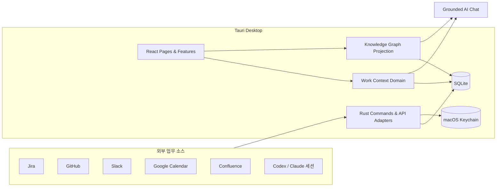

# Orbit

> 여러 도구에 흩어진 업무 맥락을 Task 중심으로 연결하고, 다음 행동까지 이어주는 macOS 업무 운영 시스템.

[](https://github.com/ckdwns9121/orbit/actions/workflows/ci.yml)
[](https://github.com/ckdwns9121/orbit/actions/workflows/release.yml)


## 왜 Orbit인가

AI 시대의 업무는 Jira, Slack, GitHub, Calendar, Confluence, 로컬 AI 세션 사이를 계속 이동합니다. 급한 일이 끼어들면 기존 작업의 진행 지점과 다음 행동을 잃기 쉽고, 완료된 업무도 회고나 성과 기록으로 남지 않습니다.

Orbit은 **Task를 업무의 기준점**으로 삼습니다. 관련 외부 정보와 AI 세션을 연결하고, 중단 시 체크포인트를 남기며, 다시 돌아왔을 때 필요한 맥락을 즉시 복원합니다. 모든 데이터는 로컬 SQLite에 저장되고 인증 정보는 macOS Keychain에 보관됩니다.

## 주요 기능

- **Task 운영** — 할 일·진행 중·완료 보드, 한 작업 집중, 중단 체크포인트, 완료 회고
- **Planner** — Today 계획, 작업 순서와 예상 시간, 월간 캘린더, 카테고리, 반복 루틴
- **업무 연동** — Jira, GitHub, Slack, Google Calendar, Confluence, 로컬 AI 세션
- **AI Chat** — 실시간 스트리밍, 대화 스레드, 출처가 연결된 업무 질의응답
- **Knowledge Graph** — Task와 외부 근거를 연결한 로컬 그래프 검색 및 Obsidian 스타일 탐색 화면
- **Dashboard** — 오늘·어제 작업, 일정, PR, 커밋과 완료 근거를 한 화면에서 확인
- **macOS 경험** — 메뉴바 Quick View, 전역 단축키, 알림, 시스템 Keychain

## 아키텍처



프런트엔드는 Feature-Sliced Design의 단방향 계층을 따릅니다.

```text
app → pages → widgets → features → entities → shared
```

- `app`: 앱 초기화, 전역 레이아웃, 내비게이션
- `pages`: Dashboard, Task, Planner, Chat, Graph 등 화면 조합
- `widgets`: 독립적인 복합 UI 블록
- `features`: 집중 전환, 외부 동기화, Task 자동 연결 같은 사용자 행동
- `entities`: WorkItem과 외부 컨텍스트의 모델·SQLite 저장소
- `shared`: 도메인에 의존하지 않는 UI, 설정, 스타일

SQLite가 원본 데이터와 재구축 가능한 Graph projection을 함께 보관합니다. 외부 쓰기는 승인·revision 검증·복구 가능한 outbox 경계를 거치며, 비밀정보는 DB가 아니라 Keychain에 저장합니다. 자세한 내용은 [Context Graph Architecture](docs/context-graph-architecture.md)와 [FSD Architecture](docs/fsd-architecture.md)를 참고하세요.

## 기술 스택

| 영역 | 기술 |
| --- | --- |
| Desktop | Tauri 2, Rust 2021 |
| Frontend | React 19, TypeScript 5.8, Vite 7 |
| Styling | Sass, Lucide React |
| Runtime / Package manager | Bun 1.3.6 |
| Local data | SQLite, Tauri SQL plugin |
| Secrets | macOS Keychain (`keyring`) |
| Networking | Rust `reqwest` + rustls |
| Testing | Bun Test, Cargo Test |
| Delivery | GitHub Actions, `tauri-action` |

## 시작하기

### 요구사항

- macOS 13 이상
- [Bun](https://bun.com/) 1.3.6
- Rust stable
- Xcode Command Line Tools

```bash
xcode-select --install
rustup target add aarch64-apple-darwin x86_64-apple-darwin
```

### 개발 실행

```bash
git clone https://github.com/ckdwns9121/orbit.git
cd orbit
bun install --frozen-lockfile
bun run tauri dev
```

앱의 **Settings → Integrations**에서 필요한 서비스만 연결합니다. API 토큰과 OAuth 시크릿은 macOS Keychain에 저장되며 Git이나 SQLite에 기록되지 않습니다.

### 품질 검증

```bash
bun run verify:fsd
bun run build
bun test
cargo test --manifest-path src-tauri/Cargo.toml --locked
bun run release:check
```

## 배포 자동화

### CI

`.github/workflows/ci.yml`은 `main` push와 Pull Request마다 다음 검증을 수행합니다.

1. 고정된 Bun lockfile로 의존성 설치
2. FSD 계층 의존 방향 검증
3. TypeScript type-check 및 Vite production build
4. Bun 테스트와 Rust 테스트
5. 세 버전 파일의 일치 여부 확인

### macOS 릴리스

`.github/workflows/release.yml`은 `vX.Y.Z` 태그 또는 Actions의 수동 실행으로 Universal macOS 앱과 DMG를 빌드해 **Draft GitHub Release**에 첨부합니다.

릴리스 전에 아래 세 파일의 버전을 동일하게 변경합니다.

- `package.json`
- `src-tauri/tauri.conf.json`
- `src-tauri/Cargo.toml`

```bash
bun run release:check
git tag v0.1.0
git push origin v0.1.0
```

Apple 인증서가 없으면 내부 테스트용 ad-hoc 서명을 사용합니다. 외부 배포용 서명과 공증을 사용하려면 GitHub repository secrets에 다음 값을 등록합니다.

| Secret | 설명 |
| --- | --- |
| `APPLE_CERTIFICATE` | Developer ID Application `.p12` 파일의 Base64 값 |
| `APPLE_CERTIFICATE_PASSWORD` | `.p12` 내보내기 비밀번호 |
| `APPLE_ID` | Apple Developer 계정 이메일 |
| `APPLE_PASSWORD` | Apple 앱 전용 비밀번호 |
| `APPLE_TEAM_ID` | Apple Developer Team ID |

인증서가 설정되면 워크플로가 임시 Keychain을 만들고 서명 인증서를 가져옵니다. 공증용 세 값이 모두 있으면 Tauri가 Apple notarization과 stapling을 수행합니다. 생성된 Draft Release의 설치 파일과 릴리스 노트를 확인한 뒤 GitHub에서 공개하세요.

## 데이터와 보안

- 업무 데이터와 Graph index는 사용자 Mac의 로컬 SQLite에 저장됩니다.
- 외부 서비스 토큰, OAuth refresh token, AI API Key는 macOS Keychain에 저장됩니다.
- 요청·응답의 password, token, authorization, cookie 등 민감 필드는 저장 전에 마스킹합니다.
- Graph는 원본 데이터를 수정하지 않는 재구축 가능한 projection입니다.

## 문서

- [문서 지도와 의사결정 절차](docs/README.md)
- [Orbit 업무 연속성 PRD](docs/prd/prd-orbit-work-continuity.md)
- [Orbit 업무 연속성 Spec](docs/prd/spec-orbit-work-continuity.md)
- [제품 원칙](docs/product/product-principles.md)
- [제품 문제 정의](docs/product-problem.md)
- [제품 솔루션](docs/product-solution.md)
- [Context Graph Architecture](docs/context-graph-architecture.md)
- [FSD Architecture](docs/fsd-architecture.md)
- [개발 우선순위 회의록](docs/meeting-notes-product-priority-2026-08-06.md)
