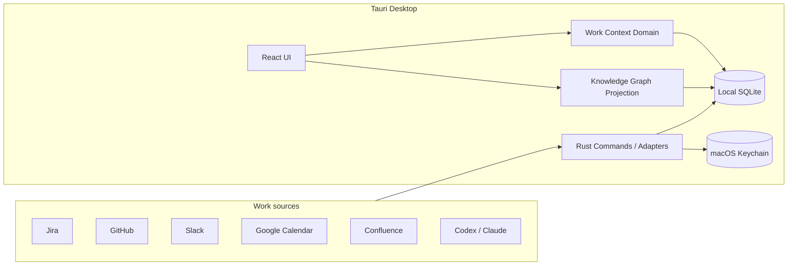

# Orbit

<p align="center">
  <strong>English</strong> ·
  <a href="README.ko.md">한국어</a> ·
  <a href="README.ja.md">日本語</a>
</p>

> A personal work-intelligence platform for macOS that connects scattered work context so you can remember less and resume work faster.

[](https://github.com/ckdwns9121/orbit/actions/workflows/ci.yml)
[](https://github.com/ckdwns9121/orbit/actions/workflows/release.yml)


Orbit is more than a todo list. It connects the **current state, next action, conversations, and development evidence** scattered across Jira, GitHub, Slack, Calendar, Confluence, and local AI sessions around a single Task. When urgent work interrupts you, Orbit helps restore the context of what you were doing and turns completed work into durable review and achievement records.

Orbit targets the cost of making people remember and reconstruct their own work state—not a shortage of todo lists.

> [!IMPORTANT]
> Orbit is an early-stage project evolving quickly around personal use. It currently supports macOS only, and integration APIs and screens may change.

## Contents

- [Why Orbit](#why-orbit)
- [Problems Orbit solves](#problems-orbit-solves)
- [Core workflow](#core-workflow)
- [Features](#features)
- [Product tour](#product-tour)
- [Integrations](#integrations)
- [Install and run](#install-and-run)
- [Technology](#technology)
- [Architecture](#architecture)
- [Development](#development)
- [Data and security](#data-and-security)
- [Documentation](#documentation)
- [Contributing and license](#contributing-and-license)

## Why Orbit

Work fragments quickly when AI tools and collaboration services are used together. Tasks and status live in Jira, discussions in Slack, implementation results in GitHub, schedules in Calendar, documents in Confluence, and execution history in Codex or Claude. The user is left responsible for connecting everything from memory.

- You jump from a Jira ticket to Slack and then to a GitHub pull request.
- You delegate work to Codex or Claude, start something else, and lose the previous stopping point.
- New notifications determine what you do instead of real priorities.
- Jira status drifts away from actual work, and on-call requests require searching Slack again.
- Completed work remains fragmented, making retrospectives and performance records difficult.

Orbit treats the **Task as the SSOT (Single Source of Truth)**. Jira issues, pull requests, commits, Slack messages, and AI sessions are evidence that explains a Task; they do not replace it. You plan the day, focus on one item, save a checkpoint before switching, and retain outcomes and evidence when work is complete.

## Problems Orbit solves

Orbit is designed to keep work context alive without demanding more manual memory from the user.

| Problem | Orbit's approach |
| --- | --- |
| Losing the stopping point while switching tasks | Preserve the latest progress, next action, and evidence as a Task checkpoint |
| Forgetting previous work after an urgent interruption | Keep active work and priorities visible and provide resume context |
| Jira state drifting from actual work | Show AI sessions, commits, PRs, and ticket state together and detect mismatches |
| Completed work disappearing instead of becoming a record | Store outcomes, decisions, risks, and development evidence in completion history |
| Repeatedly searching Slack for requests and past discussion | Search by topic and date, retain source links, and connect messages to Tasks |

Orbit performs four roles:

1. **Context recovery** — reopen a Task and see related Jira, Slack, GitHub, documents, AI sessions, and the last stopping point.
2. **Work synchronization** — identify discrepancies between Task and ticket state using external activity as evidence.
3. **Priority support** — evaluate deadlines, meetings, review requests, and active work together.
4. **Work memory** — preserve completed work as reusable retrospective and achievement material.

## Core workflow

```text
Choose today's work in Planner
        ↓
Connect Jira · GitHub · Slack · AI sessions to a Task
        ↓
Focus on one Task
        ↓
Save progress and the next action before switching
        ↓
Store outcomes · decisions · risks · evidence on completion
```

A todo created in Planner is the same underlying Task shown on the Task board, not a separate copy.

## Features

### Planner and Tasks

- Monthly planner and date-based todos
- Categories for work, study, and personal items
- Weekday-based routines and reminders
- Pin up to three must-finish tasks for today
- Todo, in-progress, and done Kanban lanes with drag and drop
- Sorting by priority, target time, and creation time

### Focus and work continuity

- A single-focus mode that allows only one focused Task
- Temporary deactivation of unrelated work and navigation while focused
- Required checkpoint and next action before switching work
- Completion reflection with connected evidence, or an explicit skip
- macOS notifications for overdue unfinished Tasks
- Configurable stretch reminders

### Connected work context

- Link assigned Jira tickets to Tasks
- Review pull requests you authored and pull requests awaiting your review
- Track PRs, commits, branches, and Jira development information
- Search Slack messages and retain source permalinks
- Discover local Codex and Claude sessions and connect them to Tasks
- Read-only Google Calendar synchronization
- Knowledge Graph exploration across Tasks and external evidence

### AI and automation

- Streaming Chat answers grounded in connected work data
- User approval before a Task proposed in Chat is created
- Discovery of relevant sessions, tickets, and messages from a Task description
- AI suggestions for priorities and target times across Tasks
- Preview and explicit approval before any external write

### macOS experience

- Menu bar Quick View for focused and upcoming work
- Global shortcuts for the Task panel and Chat
- Target-time and stretch notifications
- System, light, and dark themes
- Credentials stored in macOS Keychain

## Product tour

The screenshots below use fictional public-documentation data and contain no real user, company, repository, or work information.

### AI session linking

Discover local Codex and Claude sessions and connect them to an Orbit Task. Recent activity and linked work stay visible together.


### Single-task focus mode

Starting focus on one Task temporarily disables other work and navigation, leaving only context, completion, and exit actions available.


### Jira tickets and development evidence

Search assigned Jira tickets by state, inspect branches, commits, and pull requests, and connect the evidence to an Orbit Task.


### Grounded AI Chat

Ask questions against current Tasks, Calendar, and connected work data. AI-proposed Tasks require user approval before creation.


### Read-only Google Calendar

Review Google Calendar events in a weekly view and plan meetings alongside focus time. Orbit never edits or deletes the source calendar event.


## Integrations

| Service | Capabilities | Authentication |
| --- | --- | --- |
| Jira Cloud | Assigned tickets, state, Task links, development data | Site URL + Atlassian API token |
| Confluence | Search accessible pages and connect work evidence | Same Atlassian account as Jira |
| GitHub | Authored PRs, review requests, commit and branch tracking | Local `gh` and Git repository |
| Slack | Message search, permalink retention, Task conversion | Slack OAuth token |
| Google Calendar | Read-only event title, time, and location sync | System-browser OAuth + PKCE |
| Codex / Claude | Local session discovery, aliases, Task links | Local session files |
| OpenAI / Claude / GLM | Chat, Task analysis, automation suggestions | OAuth or provider API key |

Every integration is optional. Planner and Tasks work as a local app without connecting an external service.

## Install and run

### Download

Release builds will be available from [GitHub Releases](https://github.com/ckdwns9121/orbit/releases). Until a public release is available, run Orbit from source.

### Requirements

- macOS 13 or later
- [Bun](https://bun.sh/) 1.3.6
- Rust stable
- Xcode Command Line Tools

```bash
xcode-select --install
```

### Run from source

```bash
git clone https://github.com/ckdwns9121/orbit.git
cd orbit
bun install --frozen-lockfile
bun run tauri dev
```

macOS requests Notification permission when a notification feature is first used. Connect only the services you need from `Settings`.

### Build the macOS app

Build an App and DMG for the current Mac architecture:

```bash
bun run bundle:mac
```

For a Universal build containing Apple Silicon and Intel binaries:

```bash
rustup target add aarch64-apple-darwin x86_64-apple-darwin
bun run bundle:mac:universal
```

Artifacts are written under `src-tauri/target/release/bundle/`.

## Technology

| Area | Technology |
| --- | --- |
| Desktop shell | Tauri 2 |
| Native backend | Rust 2021, reqwest, rustls |
| Frontend | React 19, TypeScript 5.8 |
| Build | Vite 7, Bun 1.3.6 |
| Styling | Sass/SCSS, Lucide React |
| Local database | SQLite, Tauri SQL plugin |
| Secret storage | macOS Keychain, Rust `keyring` |
| Native features | Tray, global shortcuts, notifications, opener plugins |
| Testing | Bun Test, Cargo Test |
| Delivery | GitHub Actions, Tauri Action |

## Architecture



The frontend follows the one-way dependency rule of Feature-Sliced Design:

```text
app → pages → widgets → features → entities → shared
```

```text
src/
├── app/         # Bootstrap, shell, and navigation
├── pages/       # Planner, Calendar, Chat, Graph, Settings
├── widgets/     # Composite UI such as menu bar Quick View
├── features/    # Focus, sync, Task linking, notifications
├── entities/    # WorkItem and external-context models and repositories
├── shared/      # Shared UI, theme, and SCSS tokens
└── tests/       # Feature-boundary and integration tests

src-tauri/
├── migrations/  # Sequential SQLite schema migrations
└── src/         # Tauri commands, OAuth, and external API adapters
```

### Design principles

1. **The Task is the SSOT.** External tickets and conversations are linked evidence.
2. **Local first.** Work data remains in the user's SQLite database.
3. **Only one focus.** Switching focused work requires a checkpoint.
4. **External writes require approval.** They pass through preview, revision validation, and recovery boundaries.
5. **The graph is a projection.** It can be rebuilt without mutating canonical records.
6. **Secrets do not belong in the database.** Tokens and API keys are stored in Keychain.

## Development

| Command | Description |
| --- | --- |
| `bun run tauri dev` | Run Vite and the Tauri development app |
| `bun run build` | Type-check and build the production frontend |
| `bun test` | Run frontend unit and integration tests |
| `bun run verify:fsd` | Verify FSD structure and dependency direction |
| `cargo test --manifest-path src-tauri/Cargo.toml` | Run Rust tests |
| `bun run release:check` | Verify package, Tauri, and Cargo versions |
| `bun run bundle:mac` | Build the macOS App and DMG |

Recommended validation before a change:

```bash
bun run verify:fsd
bun run build
bun test
cargo fmt --manifest-path src-tauri/Cargo.toml --check
cargo test --manifest-path src-tauri/Cargo.toml --locked
bun run release:check
```

### CI and release

`.github/workflows/ci.yml` runs FSD verification, the TypeScript build, Bun tests, and Rust tests for changes to `main`. `.github/workflows/release.yml` creates a Universal macOS App and DMG for `vX.Y.Z` tags or manual runs and attaches them to a draft release.

Developer ID signing and Apple notarization are recommended for external distribution. See the [release workflow](.github/workflows/release.yml) for secret names and details.

## Data and security

- Tasks, Planner data, link metadata, and the Graph index are stored in local SQLite.
- API tokens, OAuth refresh tokens, and AI API keys are stored in macOS Keychain.
- Settings never reveal a stored secret value.
- Google Calendar requests read-only event scopes.
- Password, token, authorization, and cookie patterns are masked before logging or indexing.
- External API results distinguish fresh, stale, and failure states instead of treating failure as an empty success.
- SQLite triggers and revision checks preserve consistency across deletion and state transitions.

Default local database path:

```text
~/Library/Application Support/com.orbit.desktop/orbit.db
```

> [!CAUTION]
> Rebuilding an ad-hoc signed development app can change its code identity and trigger another Keychain permission prompt. A consistently signed Developer ID build is required for a stable distribution experience.

## Documentation

Orbit records not only what a feature does, but why its policies and architecture exist.

- [Documentation map and change process](docs/README.md)
- [Documentation guide and templates](docs/documentation-guide.md)
- [UI/UX design contract](DESIGN.md)
- [Work Continuity PRD](docs/prd/prd-orbit-work-continuity.md)
- [Work Continuity specification](docs/prd/spec-orbit-work-continuity.md)
- [Product principles](docs/product/product-principles.md)
- [Architecture Decision Records](docs/ADR/)
- [System architecture](docs/architecture/system-overview.md)
- [Technology stack and engineering standards](docs/technical/tech-stack.md)
- [Context Graph architecture](docs/context-graph-architecture.md)
- [FSD architecture](docs/fsd-architecture.md)
- [Acceptance evidence](docs/work-continuity-acceptance-evidence.md)

Changes to policy or architecture boundaries should update the related PRD, policy, or ADR.

## Contributing and license

Use [GitHub Issues](https://github.com/ckdwns9121/orbit/issues) for bug reports and feature proposals. Code contributions should preserve the existing FSD dependency direction, local-first storage policy, and external-write approval boundary, and should run the full validation suite above.

This repository does not currently declare an open-source license. Public source code is therefore not automatically licensed for use, modification, or redistribution. A license should be selected before accepting formal external contributions and redistribution.
