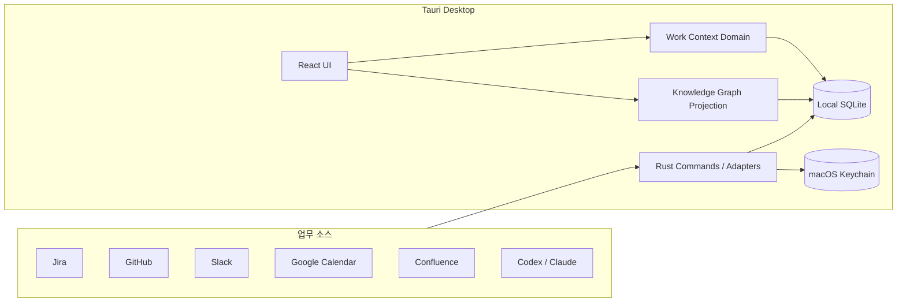

# Orbit

> Jira, GitHub, Slack, Calendar와 AI 작업 세션에 흩어진 맥락을 하나의 Task로 연결하는 macOS 업무 플래너.

[](https://github.com/ckdwns9121/orbit/actions/workflows/ci.yml)
[](https://github.com/ckdwns9121/orbit/actions/workflows/release.yml)


Orbit은 단순한 할 일 목록이 아닙니다. 업무를 전환할 때 사라지는 **진행 지점, 다음 행동, 관련 대화와 개발 근거**를 Task에 묶어두고 다시 일을 시작할 때 필요한 맥락을 복원하는 로컬 우선 데스크톱 앱입니다.

> [!IMPORTANT]
> Orbit은 현재 개인 사용을 중심으로 빠르게 개발 중인 초기 버전입니다. macOS만 지원하며 외부 연동의 API와 화면은 변경될 수 있습니다.

## 목차

- [왜 Orbit인가](#왜-orbit인가)
- [핵심 사용 흐름](#핵심-사용-흐름)
- [주요 기능](#주요-기능)
- [연동 현황](#연동-현황)
- [설치와 실행](#설치와-실행)
- [기술 스택](#기술-스택)
- [아키텍처](#아키텍처)
- [개발](#개발)
- [데이터와 보안](#데이터와-보안)
- [문서와 의사결정](#문서와-의사결정)
- [기여와 라이선스](#기여와-라이선스)

## 왜 Orbit인가

AI와 여러 협업 도구를 함께 사용하면 실제 업무 흐름은 쉽게 잘게 쪼개집니다.

- Jira 티켓을 보다가 Slack 대화를 확인하고 GitHub PR로 이동합니다.
- Codex나 Claude에게 작업을 맡긴 뒤 다른 일을 시작하면 이전 진행 지점을 잊습니다.
- 무엇을 먼저 해야 하는지보다 새 알림과 새 요청에 반응하게 됩니다.
- 완료된 업무가 흩어져 있어 회고나 성과 기록을 만들기 어렵습니다.

Orbit은 **Task를 업무의 SSOT(Single Source of Truth)** 로 사용합니다. Jira, PR, commit, Slack 메시지와 AI 세션은 Task를 설명하는 근거이며 Task 자체를 대신하지 않습니다. 사용자는 오늘 할 일을 정하고 한 작업에 집중하며, 중단할 때 체크포인트를 남기고, 완료할 때 결과와 근거를 함께 보관합니다.

## 핵심 사용 흐름

```text
Planner에서 오늘 할 일 선택
        ↓
Task에 Jira · GitHub · Slack · AI 세션 연결
        ↓
하나의 Task에 집중 시작
        ↓
중단 시 현재까지 한 것과 다음 행동 기록
        ↓
완료 시 결과 · 결정 · 위험 · 근거 저장
```

Planner에서 생성한 할 일도 별도 복사본이 아니라 즉시 Task 보드의 동일한 작업으로 표시됩니다.

## 주요 기능

### Planner와 Task

- 월간 Planner와 날짜별 할 일
- 업무·공부·개인 작업을 나누는 카테고리
- 요일 기반 반복 루틴과 리마인더
- 오늘 반드시 끝낼 핵심 작업 3개 고정
- 할 일·진행 중·완료 Kanban과 드래그 앤 드롭
- 우선순위, 목표 시간, 생성일 기준 정렬

### 집중과 업무 연속성

- 동시에 하나만 허용하는 집중 모드
- 집중 중 다른 작업과 앱 영역 비활성화
- 작업 전환 전 체크포인트와 다음 행동 기록
- 연결 근거를 포함한 완료 회고 또는 회고 건너뛰기
- 목표 시간이 지난 미완료 Task의 macOS 알림
- 설정한 주기마다 보내는 스트레칭 알림

### 연결된 업무 맥락

- 담당 Jira 티켓과 Task 연결
- 내가 만든 PR과 리뷰 요청받은 PR 확인
- PR, commit, branch와 Jira development 정보 추적
- Slack 메시지 검색과 원문 링크 연결
- Codex·Claude 로컬 세션 탐색과 Task 연결
- Google Calendar 일정 읽기 전용 동기화
- Task와 외부 근거를 탐색하는 Knowledge Graph

### AI와 자동화

- 업무 데이터에 근거한 Chat 스트리밍 응답
- 대화에서 제안된 Task를 사용자 승인 후 생성
- Task 설명을 바탕으로 관련 세션·티켓·메시지 탐색
- 전체 Task의 우선순위와 목표 시간 제안
- 외부 변경은 preview와 사용자 승인 이후에만 실행

### macOS 경험

- 메뉴바 Quick View에서 집중 작업과 다음 작업 확인
- 전역 단축키로 Task 패널과 Chat 열기
- 목표 시간·스트레칭 알림
- 시스템 테마와 라이트·다크 테마
- macOS Keychain 기반 인증정보 저장

## 연동 현황

| 서비스 | 제공 기능 | 인증 방식 |
| --- | --- | --- |
| Jira Cloud | 내 담당 티켓, 상태, Task 연결, development 정보 | 사이트 URL + Atlassian API token |
| Confluence | 권한이 있는 문서 검색과 업무 근거 연결 | Jira와 동일한 Atlassian 계정 |
| GitHub | 내가 만든 PR, 리뷰 요청 PR, commit·branch 추적 | 로컬 `gh` 및 Git repository |
| Slack | 메시지 검색, permalink 보관, Task 변환 | Slack OAuth token |
| Google Calendar | 일정 제목·시간·장소 읽기 전용 동기화 | 시스템 브라우저 OAuth + PKCE |
| Codex / Claude | 로컬 작업 세션 탐색, 별칭, Task 연결 | 로컬 세션 파일 |
| OpenAI / Claude / GLM | Chat, Task 분석과 자동화 제안 | OAuth 또는 provider API key |

연동은 선택 사항입니다. 외부 서비스를 연결하지 않아도 Planner와 Task는 로컬 앱으로 사용할 수 있습니다.

## 설치와 실행

### 다운로드

배포 빌드는 [GitHub Releases](https://github.com/ckdwns9121/orbit/releases)에서 제공할 예정입니다. 아직 공개 Release가 없다면 아래 개발 실행 방법으로 사용할 수 있습니다.

### 요구사항

- macOS 13 이상
- [Bun](https://bun.sh/) 1.3.6
- Rust stable
- Xcode Command Line Tools

```bash
xcode-select --install
```

### 소스에서 실행

```bash
git clone https://github.com/ckdwns9121/orbit.git
cd orbit
bun install --frozen-lockfile
bun run tauri dev
```

처음 알림을 사용하는 경우 macOS가 Notification 권한을 요청합니다. 외부 서비스는 앱의 `Settings`에서 필요한 항목만 연결하면 됩니다.

### macOS 앱 빌드

현재 Mac 아키텍처용 앱과 DMG를 생성합니다.

```bash
bun run bundle:mac
```

Apple Silicon과 Intel을 모두 포함한 Universal 빌드는 두 Rust target을 먼저 설치해야 합니다.

```bash
rustup target add aarch64-apple-darwin x86_64-apple-darwin
bun run bundle:mac:universal
```

생성물은 `src-tauri/target/release/bundle/` 아래에서 확인할 수 있습니다.

## 기술 스택

| 영역 | 기술 |
| --- | --- |
| Desktop shell | Tauri 2 |
| Native backend | Rust 2021, reqwest, rustls |
| Frontend | React 19, TypeScript 5.8 |
| Build tool | Vite 7, Bun 1.3.6 |
| Styling | Sass/SCSS, Lucide React |
| Local database | SQLite, Tauri SQL plugin |
| Secret storage | macOS Keychain, Rust `keyring` |
| Native features | Tray, global shortcut, notification, opener plugins |
| Testing | Bun Test, Cargo Test |
| Delivery | GitHub Actions, Tauri Action |

## 아키텍처



프런트엔드는 Feature-Sliced Design의 단방향 의존 규칙을 따릅니다.

```text
app → pages → widgets → features → entities → shared
```

```text
src/
├── app/         # 앱 초기화, 레이아웃, 내비게이션
├── pages/       # Planner, Calendar, Chat, Graph, Settings 화면
├── widgets/     # 메뉴바 Quick View 같은 복합 UI
├── features/    # 집중, 동기화, Task 연결, 알림 같은 사용자 행동
├── entities/    # WorkItem 및 외부 컨텍스트 모델과 repository
├── shared/      # 공통 UI, theme, SCSS token
└── tests/       # 기능 경계와 통합 테스트

src-tauri/
├── migrations/  # 순차 적용되는 SQLite schema migration
└── src/         # Tauri command, OAuth, 외부 API adapter
```

### 핵심 설계 원칙

1. **Task가 SSOT다.** 외부 티켓과 대화는 Task에 연결된 근거다.
2. **로컬이 우선이다.** 업무 데이터는 사용자의 SQLite에 저장한다.
3. **집중은 하나만 가능하다.** 전환에는 체크포인트가 필요하다.
4. **외부 쓰기는 승인받는다.** preview, revision 검증과 복구 경계를 거친다.
5. **그래프는 projection이다.** 원본을 오염시키지 않고 언제든 재구축할 수 있다.
6. **비밀은 DB에 넣지 않는다.** token과 API key는 Keychain에 저장한다.

## 개발

### 자주 쓰는 명령어

| 명령어 | 설명 |
| --- | --- |
| `bun run tauri dev` | Vite와 Tauri 개발 앱 실행 |
| `bun run build` | TypeScript 검사와 production frontend build |
| `bun test` | 프런트엔드 unit·integration test 실행 |
| `bun run verify:fsd` | FSD 폴더 구조와 의존 방향 검사 |
| `cargo test --manifest-path src-tauri/Cargo.toml` | Rust test 실행 |
| `bun run release:check` | package, Tauri, Cargo 버전 일치 검사 |
| `bun run bundle:mac` | macOS App과 DMG 빌드 |

### 변경 전 권장 검증

```bash
bun run verify:fsd
bun run build
bun test
cargo fmt --manifest-path src-tauri/Cargo.toml --check
cargo test --manifest-path src-tauri/Cargo.toml --locked
bun run release:check
```

### CI와 릴리스

`.github/workflows/ci.yml`은 `main` 변경마다 FSD, TypeScript build, Bun test와 Rust test를 실행합니다. `.github/workflows/release.yml`은 `vX.Y.Z` 태그 또는 수동 실행으로 Universal macOS 앱과 DMG를 만들어 Draft Release에 첨부합니다.

외부 배포는 Developer ID 서명과 Apple notarization을 권장합니다. 관련 secret 이름과 상세 절차는 [릴리스 워크플로](.github/workflows/release.yml)에서 확인할 수 있습니다.

## 데이터와 보안

- Task, Planner, 연결 메타데이터와 Graph index는 로컬 SQLite에 저장됩니다.
- API token, OAuth refresh token과 AI API key는 macOS Keychain에 저장됩니다.
- 설정 화면은 저장된 secret 원문을 다시 표시하지 않습니다.
- Google Calendar는 일정 event 읽기 전용 scope만 요청합니다.
- password, token, authorization, cookie 패턴은 로그와 index 저장 전에 마스킹합니다.
- 외부 API 실패를 빈 성공으로 처리하지 않고 fresh·stale·failure 상태를 구분합니다.
- 삭제와 상태 전이는 SQLite trigger와 revision 검증으로 데이터 일관성을 지킵니다.

로컬 DB의 기본 위치는 다음과 같습니다.

```text
~/Library/Application Support/com.orbit.desktop/orbit.db
```

> [!CAUTION]
> 개발용 ad-hoc 서명 앱은 다시 빌드할 때 코드 identity가 바뀌어 Keychain 권한을 다시 요청할 수 있습니다. 안정적인 배포 경험에는 동일한 Developer ID로 서명된 빌드를 사용해야 합니다.

## 문서와 의사결정

Orbit은 기능 설명뿐 아니라 **왜 이런 정책과 구조를 선택했는지**를 repository에 함께 기록합니다.

- [문서 지도와 변경 절차](docs/README.md)
- [업무 연속성 PRD](docs/prd/prd-orbit-work-continuity.md)
- [업무 연속성 Spec](docs/prd/spec-orbit-work-continuity.md)
- [제품 원칙](docs/product/product-principles.md)
- [Architecture Decision Records](docs/ADR/)
- [Context Graph Architecture](docs/context-graph-architecture.md)
- [FSD Architecture](docs/fsd-architecture.md)
- [수용 기준 검증 증거](docs/work-continuity-acceptance-evidence.md)

정책이나 아키텍처 경계를 바꾸는 변경은 관련 PRD, Policy 또는 ADR도 함께 갱신합니다.

## 기여와 라이선스

버그 제보와 기능 제안은 [GitHub Issues](https://github.com/ckdwns9121/orbit/issues)를 이용해주세요. 코드를 변경할 때는 기존 FSD 의존 방향, 로컬 우선 저장 원칙과 외부 쓰기 승인 경계를 유지하고 위의 전체 검증을 실행해주세요.

현재 repository에는 별도 오픈소스 라이선스가 지정되어 있지 않습니다. 따라서 공개된 소스의 사용·수정·재배포 권한이 자동으로 부여되지는 않습니다. 정식 외부 기여와 재배포를 받기 전에 라이선스를 확정할 예정입니다.
