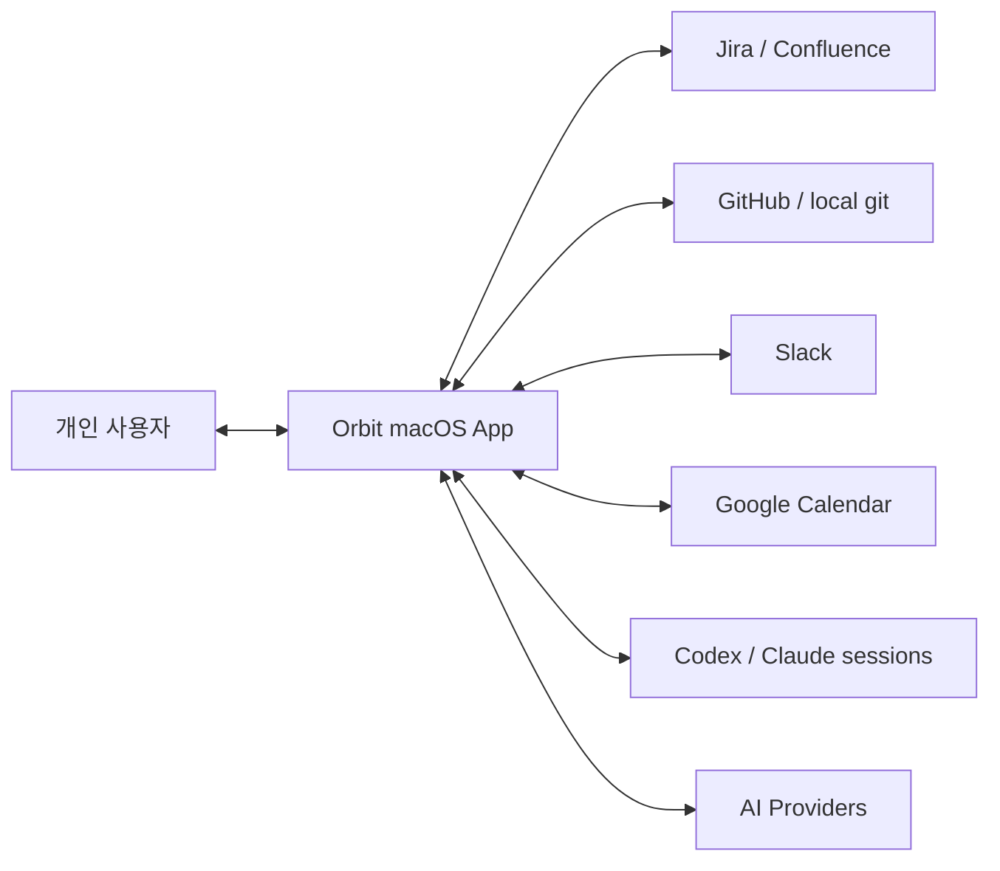
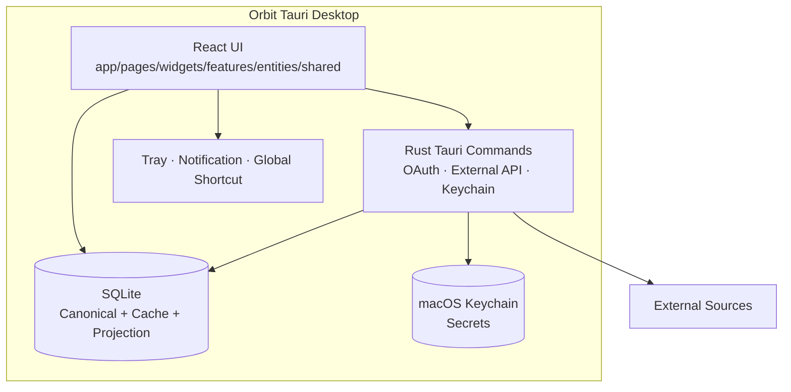

# Orbit System Architecture

- 상태: Accepted
- 소유자: Orbit maintainer
- 작성일: 2026-08-15
- 최종 갱신: 2026-08-15
- 관련 문서: [업무 연속성 PRD](../prd/prd-orbit-work-continuity.md), [제품 원칙](../product/product-principles.md)

## 목적

이 문서는 Orbit 전체 시스템의 실행 경계, 데이터 소유권과 주요 데이터 흐름을 정의한다. 기능별 상세 계약은 Feature Spec과 Technical Design이 소유한다.

## 시스템 컨텍스트



## 컨테이너



## 데이터 소유권

| 데이터 | 기준 저장소 | 파생 데이터 | 비고 |
| --- | --- | --- | --- |
| Task·focus·completion | SQLite canonical tables | Dashboard·Graph view | Orbit이 소유 |
| Jira·Slack·Calendar 등 원본 | 외부 서비스 | SQLite source cache | provenance·freshness 보존 |
| Context Graph | canonical table과 source cache | versioned graph generation | 삭제·재구축 가능 |
| 인증정보 | macOS Keychain | 연결 여부만 설정에 저장 | 평문 재표시 금지 |
| AI 응답·실행 | Chat·agent run tables | UI stream state | 승인 경계와 근거 보존 |

## 핵심 실행 흐름

### 읽기 동기화

```text
사용자 또는 TTL refresh
  → Rust adapter가 외부 API 호출
  → source/scope별 cache 갱신
  → fresh·stale·failed 상태 기록
  → UI와 Graph projection 갱신
```

### 외부 쓰기

```text
정확한 대상 조회
  → preview 생성
  → 사용자 승인
  → revision/hash 검증
  → durable outbox 실행
  → succeeded 또는 needs-reconciliation
```

### AI 실행

```text
사용자 요청
  → 사용 가능한 source와 권한 확인
  → 근거 수집·도구 실행 계획
  → streaming 응답 또는 mutation preview
  → mutation은 사용자 승인 후 실행
  → 결과와 근거 저장
```

## 품질 속성

- Local-first: 외부 장애 중에도 Task·Planner·저장된 맥락을 사용할 수 있다.
- Integrity: revision, transaction과 forward-only migration으로 상태 손상을 막는다.
- Explainability: 자동 연결·AI 응답·외부 변경에 출처와 이유가 있다.
- Recoverability: projection과 cache는 재구축 가능하고 outbox는 재기동 후 복구된다.
- Privacy: secret은 Keychain에 저장하고 index·로그 전에 민감정보를 제거한다.
- Performance: 긴 목록은 bounded query·pagination·virtualization을 사용한다.

## Trust boundaries

- React UI는 secret 원문을 소유하지 않는다.
- Rust command는 외부 API와 Keychain 접근을 캡슐화한다.
- 외부 응답은 신뢰하지 않고 schema·상태·scope를 검증한다.
- AI 출력은 제안이며 canonical state를 직접 변경하지 않는다.

## 배포 구조

- GitHub Actions가 FSD, TypeScript, Bun과 Rust 검증을 실행한다.
- macOS universal bundle은 Tauri Action으로 생성한다.
- 안정적인 Keychain 경험을 위해 동일한 Developer ID 서명과 notarization을 사용한다.

## 관련 결정

- [ADR-001 Task를 업무 SSOT로 사용](<../ADR/[ADR-001] Task를 업무 SSOT로 사용.md>)
- [ADR-002 로컬 우선 SQLite 저장](<../ADR/[ADR-002] 로컬 우선 SQLite 저장.md>)
- [ADR-005 Context Graph를 재구축 가능한 Projection으로 운영](<../ADR/[ADR-005] Context Graph를 재구축 가능한 Projection으로 운영.md>)
- [ADR-006 프런트엔드 FSD 의존 방향 적용](<../ADR/[ADR-006] 프런트엔드 FSD 의존 방향 적용.md>)
