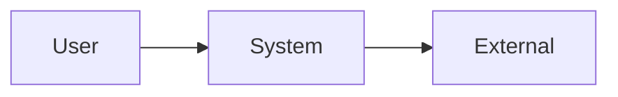
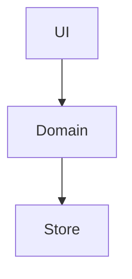

# Architecture: [시스템 또는 영역]

- 상태: Draft
- 소유자: [이름 또는 역할]
- 작성일: YYYY-MM-DD
- 최종 갱신: YYYY-MM-DD
- 관련 문서: [PRD], [RFC], [ADR]

## Purpose and scope

- 이 문서가 소유하는 경계:
- 포함:
- 제외:

## Context

## Containers/components

| 구성요소 | 책임 | 소유 데이터 | 의존성 |
| --- | --- | --- | --- |
| [component] | [responsibility] | [data] | [dependency] |

## Data ownership and flow

- canonical data:
- cache:
- projection/index:
- secret:
- retention/deletion:

## Interfaces

| Interface | Caller | Contract | Failure mode |
| --- | --- | --- | --- |
| [API/event] | [caller] | [contract] | [failure] |

## Quality attributes

- Reliability:
- Performance:
- Security/privacy:
- Observability:
- Recoverability:
- Accessibility, if user-facing:

## Trust boundaries

[인증, 외부 입력, AI 출력과 privilege 경계를 설명한다.]

## Failure and recovery

| Failure | Blast radius | Detection | Recovery |
| --- | --- | --- | --- |
| [failure] | [impact] | [signal] | [procedure] |

## Deployment and operations

- build/release:
- configuration:
- migration:
- rollback:

## Decisions and constraints

- [ADR 링크]
- [Policy 링크]

## Open questions

- [ ] 질문 / 담당자 / 영향
