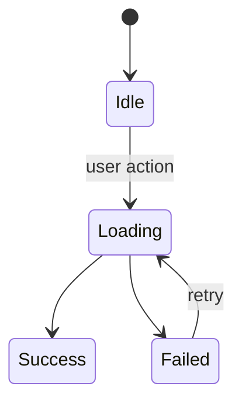

# Spec: [기능 이름]

- 상태: Draft
- 소유자: [이름 또는 역할]
- 작성일: YYYY-MM-DD
- 최종 갱신: YYYY-MM-DD
- Linked PRD: [링크]
- 관련 Technical Design: [링크 또는 TBD]

## 1. 기능 계약

| 기능 | 사용자에게 보장할 동작 |
| --- | --- |
| [기능] | [계약] |

## 2. 화면과 진입점

- 진입점:
- 주요 화면·패널:
- 권한 또는 선행 조건:

## 3. 상태 모델



각 상태에서 허용되는 행동과 복구 방법을 설명한다.

## 4. 사용자 시퀀스

```text
[actor] → [UI] → [domain/repository] → [external/native] → [result]
```

## 5. 데이터와 API 계약

### Input

```ts
interface Input {
  // fields
}
```

### Output

```ts
type Result =
  | { status: "success" }
  | { status: "failed"; reason: string };
```

- validation:
- idempotency:
- revision/concurrency:
- persistence:

## 6. UI 상태

- Loading:
- Empty:
- Stale:
- Error:
- Success:
- Disabled:
- Offline:

## 7. 오류와 복구

| 오류 | 사용자 표시 | 데이터 영향 | 복구 |
| --- | --- | --- | --- |
| [오류] | [문구·상태] | [없음/부분] | [재시도·reconcile] |

## 8. 테스트 시나리오

- **TS-1:** 정상 흐름
- **TS-2:** validation 실패
- **TS-3:** stale revision 또는 동시성 충돌
- **TS-4:** 외부 API 실패·부분 성공
- **TS-5:** 재기동·복구
- **TS-6:** keyboard·screen reader·reduced motion

## 9. AC 매핑

| PRD AC | Scenario | Verification | Evidence path |
| --- | --- | --- | --- |
| AC-1 | TS-1 | unit/integration/e2e | TBD |

## 10. 열린 질문

- [ ] 질문 / 담당자 / 영향
