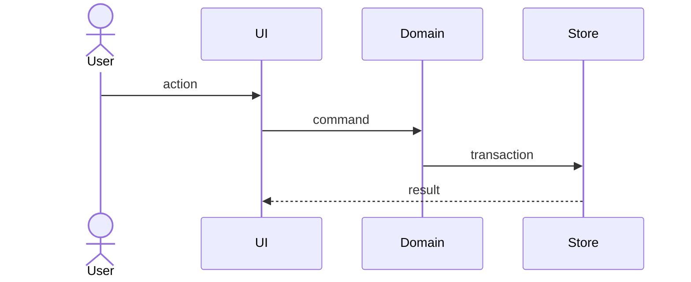

# Technical Design: [변경 이름]

- 상태: Draft
- 소유자: [이름 또는 역할]
- 작성일: YYYY-MM-DD
- 최종 갱신: YYYY-MM-DD
- 대상 릴리스: [버전 또는 TBD]
- 관련 문서: [PRD], [Spec], [Architecture], [ADR]

## 1. Summary

[구현할 변경과 핵심 기술 접근]

## 2. Current state

- 관련 코드 경로:
- 현재 데이터 흐름:
- 확인된 문제:

## 3. Proposed design

### Module ownership

| Layer/module | Change | Responsibility |
| --- | --- | --- |
| [path] | add/change/remove | [책임] |

### Sequence



### Data/schema

- schema changes:
- migration/backfill:
- indexes:
- retention:

### API/types

```ts
// proposed public contract
```

### UI and interaction

- `DESIGN.md` sections used:
- loading/empty/error/stale/success:
- keyboard/accessibility:

## 4. Concurrency and failure handling

- idempotency:
- revision/locking:
- partial success:
- retry/reconciliation:
- restart recovery:

## 5. Security and privacy

- trust boundary:
- secret handling:
- logging/redaction:
- external scopes:

## 6. Performance

- expected scale:
- query/render budget:
- pagination/virtualization/cache:
- measurement plan:

## 7. Rollout

1. [단계]
2. [단계]

- feature flag:
- backward compatibility:
- rollback:

## 8. Verification

| Level | Scenario | Command/evidence |
| --- | --- | --- |
| unit | [scenario] | [path] |
| integration | [scenario] | [path] |
| e2e/manual | [scenario] | [artifact] |

## 9. Alternatives rejected

| Alternative | Rejected because |
| --- | --- |
| [option] | [reason] |

## 10. Open questions

- [ ] 질문 / 담당자 / 기한
